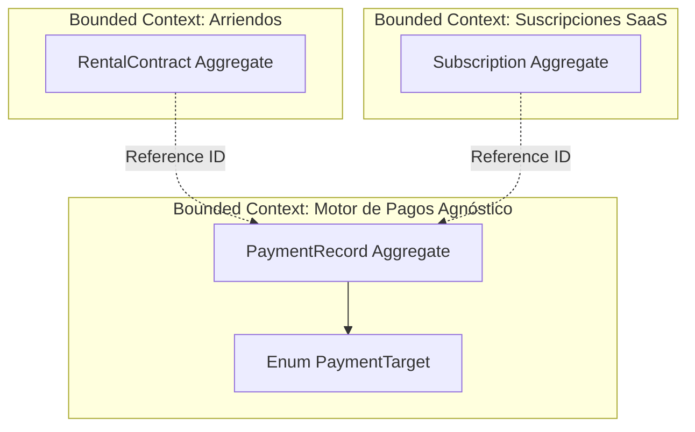
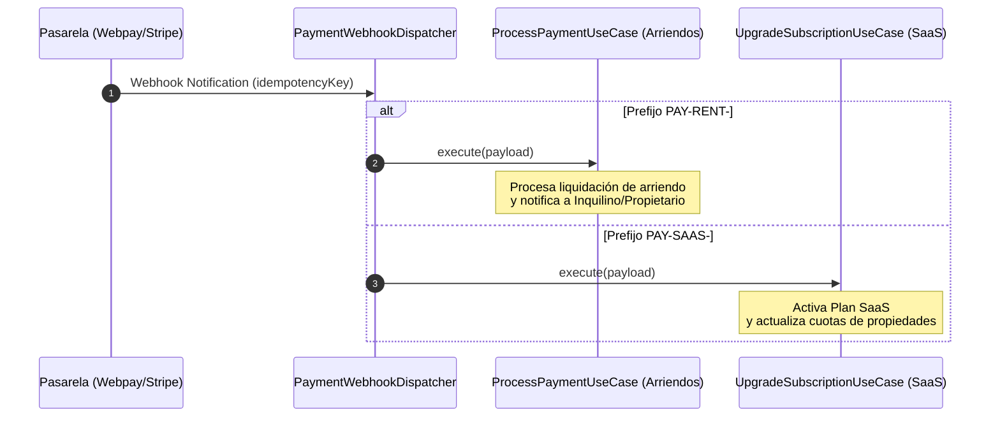

# Architectural Decision Records (ADRs) — RentFlowAI

---

## ADR-001: Separación de Bounded Contexts entre Cobros de Arriendos y Suscripciones SaaS (`PaymentRecord` Evolution)

* **Estado:** Aceptado (Accepted)
* **Fecha:** 30-Agosto-2026
* **Autores:** Staff Software Engineer & Lead Domain Architect
* **Área Técnica:** Domain-Driven Design (DDD), Subdominio Financiero, Arquitectura Hexagonal

---

### 1. Contexto y Problema

La plataforma **RentFlowAI** opera bajo un modelo de negocio dual que requiere procesar transacciones monetarias a través de pasarelas de pago (Webpay, Stripe, etc.) para dos tipos de clientes con necesidades radicalmente distintas:

1. **Cobro de Arriendos Mensuales (Rental Payments):** Transacciones ejecutadas por **Inquilinos (Tenants)** para cumplir con las cuotas de arriendo pactadas en un `RentalContract` a favor de un **Propietario (Landlord)**.
2. **Cobro de Suscripciones SaaS (SaaS Billing):** Transacciones ejecutadas por **Propietarios o Gestores Inmobiliarios** para pagar la tarifa del plan de software SaaS (Starter, Pro, Enterprise) a favor de **RentFlowAI**.

En las etapas iniciales del proyecto, se consideró la alternativa simplista de reutilizar la entidad `RentalContract` o acoplar la entidad de pago `PaymentRecord` directamente a un `contractId`. Sin embargo, esta aproximación introduce serios problemas de acoplamiento y violación de principios de diseño de software.

---

### 2. Análisis Técnico: ¿Por qué mezclar ambos cobros destruye la Cohesión del Dominio?

Intentar forzar los pagos de suscripciones SaaS dentro de la estructura de un contrato de arriendo representa un **Anti-Patrón de Modelado** que atenta contra las reglas de **Domain-Driven Design (DDD)** por las siguientes razones fundamentales:

#### 2.1. Violación del Lenguaje Ubicuo (Ubiquitous Language)
En el dominio inmobiliario, las entidades y términos poseen significados estrictos:
* En **Rental Domain**: Un `RentalContract` vincula a un `Tenant` con un inmueble (`Property`) durante un período legal, con conceptos como *mes de garantía*, *multa por mora diaria*, *reajuste por UF/IPC* y *fecha de entrega del inmueble*.
* En **SaaS Billing Domain**: Una `Subscription` vincula una cuenta de cliente con una tarifa de software (`SubscriptionPlan`), con conceptos como *período de prueba (Trial)*, *límite de propiedades activas (Seats/Quotas)*, *renovación automática (Auto-Renew)*, *downgrade/upgrade de plan* y *gestión de reintentos de cobro (Dunning)*.

Forzar un "RentalContract ficticio" para cobrar el SaaS contamina el modelo con atributos nulos o irrelevantes, destruyendo la claridad del código.

#### 2.2. Flujo Financiero y Liquidación Divergentes (Money Routing & Settlement)
* **Cobro de Arriendo:** Es un pago entre terceros (*P2P / Escrow*). RentFlowAI actúa como facilitador o canalizador. El dinero cobrado al inquilino pertenece al Propietario (descontando la comisión de la plataforma).
* **Cobro de Suscripción SaaS:** Es un pago B2B/B2C directo (*Merchant of Record* / Venta Directa). El dinero cobrado al propietario ingresa directamente a las arcas operativas de RentFlowAI.

#### 2.3. Divergencia en los Ciclos de Vida y Reglas de Negocio (Invariantes)

```
┌────────────────────────────────────────────────────────────────────────────────────────┐
│                          DIVERGENCIA DE CICLOS DE VIDA                                  │
├───────────────────────────────────────────┬────────────────────────────────────────────┤
│           RENTAL CONTRACT DOMAIN          │            SAAS BILLING DOMAIN             │
├───────────────────────────────────────────┼────────────────────────────────────────────┤
│ • Mora dispara multas diarias congeladas. │ • Mora dispara suspensión gradual del App. │
│ • No existe Upgrade o Downgrade de cuota. │ • Soporta Upgrade/Downgrade pro-rateado.   │
│ • La falta de pago origina desalojo.      │ • La falta de pago cancela el plan SaaS.   │
│ • Requiere verificación de ocupación.     │ • Requiere verificación de Feature Toggles.│
└───────────────────────────────────────────┴────────────────────────────────────────────┘
```

---

### 3. Fuerzas y Decisiones Arquitectónicas (The Decision)

Se acuerda aplicar una estricta **Separación de Bounded Contexts**:



1. **Aislamiento de Bounded Contexts:** Los dominios `RentalContract` y `SaaS Billing` permanecerán aislados en paquetes y agregados independientes. Ninguno importará ni dependerá de las entidades del otro.
2. **Motor de Pagos Agnóstico:** El subdominio de pagos (`payment`) actuará como un motor reutilizable y agnóstico a la naturaleza del cobro.
3. **Evolución de `PaymentRecord` (Reference ID & PaymentTarget):**
   * Se elimina la dependencia directa exclusiva de `contractId`.
   * Se introduce el atributo abstracto `referenceId` (UUID), que almacenará el ID del agregado origen (sea un `contractId` o un `subscriptionId`).
   * Se añade la enumeración `PaymentTarget` para categorizar la naturaleza de la transacción (`RENTAL_CONTRACT`, `SAAS_SUBSCRIPTION`).

---

### 4. Detalles de Implementación en la Entidad `PaymentRecord`

#### 4.1. Definición del Enum `PaymentTarget`

```java
package com.marco.rentflow.core.domain.payment;

public enum PaymentTarget {
    RENTAL_CONTRACT,
    SAAS_SUBSCRIPTION
}
```

#### 4.2. Estructura Reorganizada de `PaymentRecord.java`

```java
public class PaymentRecord {
    private final UUID id;
    private final UUID referenceId;      // ID Agnóstico (contractId o subscriptionId)
    private final UUID payerUserId;     // ID del usuario pagador (Tenant o Landlord)
    private final PaymentTarget target;  // RENTAL_CONTRACT o SAAS_SUBSCRIPTION
    private final String idempotencyKey;

    private final LocalDate dueDate;
    private LocalDate paymentDate;

    private Money paidAmount;
    private final Money expectedAmount;
    private Money lateFeeApplied;

    private PaymentStatus status;
    private String transactionReference;
    private String paymentReceiptUrl;
    
    // Métodos de fábrica y reglas de negocio...
}
```

---

### 5. Enrutamiento de Webhooks e Idempotencia por Prefijo

Para evitar colisiones de llaves de idempotencia y enrutar las respuestas de las pasarelas al Caso de Uso correcto, las llaves incorporarán el prefijo de la entidad objetivo:

#### 5.1. Convención de Formato de Idempotency Key:
* **Arriendos:** `PAY-RENT-{contractId}-{YYYY-MM}`
* **Suscripciones SaaS:** `PAY-SAAS-{subscriptionId}-{YYYY-MM}`

#### 5.2. Enrutamiento en el Dispatcher de Pagos (Capa de Aplicación)



---

### 6. Consecuencias

#### Consecuencias Positivas (+)
* **Alta Cohesión y Bajo Acoplamiento:** Los modelos de arriendos y suscripciones pueden evolucionar, agregar campos y modificar sus reglas de negocio sin afectar al motor de pagos.
* **Reusabilidad Extensible:** Permite añadir futuros tipos de cobro en RentFlowAI (ejemplo: `MAINTENANCE_FEE` o `SECURITY_DEPOSIT`) simplemente añadiendo un valor a `PaymentTarget` sin modificar el esquema central de la base de datos.
* **Claridad en Auditorías Financieras:** La contabilidad puede separar de manera nativa los ingresos propios de la plataforma (SaaS) de los fondos en custodia de terceros (Arriendos).

#### Consecuencias Negativas / Trade-offs (-)
* **Capa de Enrutamiento Adicional:** Requiere implementar un Dispatcher en la capa de aplicación para inspeccionar la clave o el target y derivar al Caso de Uso correspondiente.
* **Pérdida de Foreign Keys Directas en BD:** Al volver el campo `reference_id` polimórfico en PostgreSQL, la integridad referencial no se valida mediante un FK rígido de BD, sino que es garantizada estrictamente por los Casos de Uso de la Capa de Aplicación.

---

### 7. Estado de Ejecución
* **Fase Actual:** Diseño y aprobación documental (Semana 3).
* **Refactorización de Código:** Implementación programada dentro de la hoja de ruta del módulo SaaS (Semanas 6+).