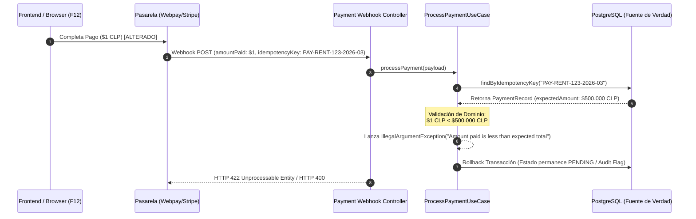

# Security & Resilience Architecture — RentFlowAI Payments

## 1. Visión General y Filosofía de Consistencia (Teorema CAP)

En los sistemas financieros y motores de cobro en la nube, el **Teorema CAP** impone que ante una partición de red ($P$), un sistema distribuido debe elegir entre **Consistencia ($C$)** o **Disponibilidad ($A$)**. 

Para el motor de pagos de **RentFlowAI**, la decisión arquitectónica es categórica: priorizamos un modelo **CP (Consistency + Partition Tolerance)** sobre la Disponibilidad ($AP$). En un SaaS inmobiliario y de procesamiento monetario, un fallo de disponibilidad genera un reintento temporal en el cliente, mientras que un fallo de consistencia (ejemplo: cobro duplicado, saldo desalineado o cuota liquidada sin registrar el pago) genera pérdida financiera, disputas legales y fractura de la confianza del cliente.

```
       [ Teorema CAP en RentFlowAI ]
                   / \
                  /   \
                 /  x  \  <-- Rechazado: AP (Disponibilidad sin consistencia)
                /       \
   Consistencia (C) ---- Tolerancia a Particiones (P)
               [ Modelo CP Elegido ]
```

### 1.1. Materialización en la Capa de Infraestructura (PostgreSQL ACID)

La consistencia estricta en el almacenamiento de datos se apoya en el cumplimiento riguroso de las propiedades **ACID** en PostgreSQL:

* **Atomicidad (A):** Todas las mutaciones requeridas durante la liquidación de un pago (actualización del `PaymentRecord` a `PAID`, vinculación de `transactionReference` y actualización de auditoría) ocurren como una única unidad de trabajo indivisible. Si alguna instrucción falla, se revierte el $100\%$ de los cambios.
* **Consistencia (C):** Los constraints de la base de datos (Llaves Primarias, Unicidad de `idempotency_key`, llaves foráneas y Not-Null constraints) garantizan que ninguna transacción deje la BD en un estado inválido o financieramente corrupto.
* **Aislamiento (I):** El motor utiliza el nivel de aislamiento `READ COMMITTED` por defecto (con bloqueo pesimista/optimista según el flujo) para prevenir *Dirty Reads* y *Non-Repeatable Reads* durante el procesamiento concurrente de webhooks.
* **Durabilidad (D):** Una vez que PostgreSQL confirma la transacción (`COMMIT`), los datos se persisten en el *Write-Ahead Log* (WAL), garantizando supervivencia ante caídas del servidor.

### 1.2. Delimitación de Transacciones en la Capa de Aplicación (`@Transactional`)

En la arquitectura limpia Hexagonal / DDD de RentFlowAI, los **Casos de Uso** (`ProcessPaymentUseCase`, `InitiatePaymentCheckoutUseCase`) actúan como los orquestadores transaccionales.

* **Frontera Transaccional:** Cada método ejecutor del Caso de Uso se anota con `@Transactional(rollbackFor = Exception.class)` de Spring Framework.
* **Semántica de Rollback:** Cualquier excepción de tiempo de ejecución (`RuntimeException`) o exepción chequeda de negocio (ej. `InsufficientAmountException`, `CurrencyMismatchException`) disparada por el Agregado de Dominio revierte automáticamente la transacción en la BD.
* **Integridad entre Agregados:** Evita el estado parcial "fantasma": el pago no quedará marcado como `PAID` si la actualización del contrato o la auditoría falla.

### 1.3. Tolerancia a Particiones e Idempotencia Determinista

Las particiones de red o la inestabilidad de las pasarelas de pago (Stripe, Webpay) suelen provocar retries automáticos y peticiones duplicadas. RentFlowAI neutraliza la duplicidad mediante **Llaves de Idempotencia Deterministas**:

$$\text{IdempotencyKey} = \text{PAY-RENT-}\{contractId\text{\}-}\{YYYY\text{\}-}\{MM\text{\}}$$

* Si un Webhook o petición HTTP se duplica por reintento de red, el constraint único en PostgreSQL (`idempotency_key UNIQUE`) o la comprobación previa en el agregante `PaymentRecord.isPaid()` detecta el intento y responde de forma idempotente sin duplicar transacciones ni mutar saldos.

---

## 2. Estrategia Zero Trust: Prevención de Parameter Tampering (F12)

### 2.1. Modelo de Amenaza (Client-Side Tampering)

En aplicaciones web y móviles, el Frontend (navegador web o app nativa) se clasifica bajo el modelo **Zero Trust** (Confianza Cero). El cliente es un entorno enteramente manipulable por el usuario o por actores maliciosos mediante herramientas de inspección como Chrome DevTools (F12), Proxies de interceptación (Burp Suite, OWASP ZAP) o scripts de consolas.

```
[ Atacante / DevTools F12 ] 
          │
          ├─► 1. Captura Payload HTTP: { contractId: "abc", amount: 500000 }
          ├─► 2. Modifica Payload:     { contractId: "abc", amount: 1 }  <-- Parameter Tampering
          └─► 3. Envía a Pasarela (Webpay/Stripe)
```

**Vector de Ataque:** Modificar el parámetro del monto (`amount`) en la petición HTTP entrante o saliente para pagar $\$1$ peso o $\$1$ USD en lugar del valor real del arriendo (ej. $\$500.000$ CLP).

### 2.2. La Defensa: El Backend como Única Fuente de la Verdad (Single Source of Truth)

RentFlowAI implementa un patrón de desacoplamiento defensivo donde el monto declarado o transmitido por el cliente frontend **es completamente ignorado** por el motor de aplicación.



#### Reglas de Invariante en el Agregado de Dominio (`PaymentRecord.java`):

1. **Congelamiento de Monto (`expectedAmount`):** Al iniciar la intención de pago (`InitiatePaymentCheckoutUseCase`), el sistema calcula la cuota, reajustes y multas congelando el valor en la columna `expected_amount` de la BD.
2. **Validación Inflexible en `registerPayment`:**

```java
public void registerPayment(Money amountPaid, LocalDate actualPaymentDate, Money lateFee, String transactionRef, String receiptUrl) {
    if (this.status == PaymentStatus.PAID) {
        throw new IllegalStateException("Payment has already been settled");
    }

    if (this.expectedAmount.getCurrency() != amountPaid.getCurrency()) {
        throw new IllegalArgumentException("Payment currency does not match expected currency");
    }

    // El Backend valida contra su propia Fuente de la Verdad
    if (amountPaid.getAmount().compareTo(this.expectedAmount.getAmount()) < 0) {
        throw new IllegalArgumentException("Amount paid is less than expected total");
    }
    
    // Transición de estado segura...
}
```

Si el monto notificado por el Webhook de la pasarela es inferior a `expectedAmount`, el sistema aborta inmediatamente la transacción, registra el evento de seguridad y no marca la deuda como pagada.

---

## 3. Autenticidad de Webhooks (Protección Criptográfica HMAC)

### 3.1. Vector de Ataque: Simulación de Webhooks (Spoofing)

Puesto que los endpoints de Webhooks (`/api/v1/payments/webhook`) son URLs públicas accesibles desde Internet para recibir notificaciones asíncronas de las pasarelas, un atacante podría enviar peticiones `POST` falsificadas pretendiendo que un pago fue aprobado exitosamente.

### 3.2. Mecanismo de Defensa: Signatures HMAC-SHA256

Para verificar origen e integridad, RentFlowAI exige la validación de firmas criptográficas basadas en **HMAC (Hash-based Message Authentication Code)** utilizando el algoritmo **SHA-256**.

```
  Payload del Webhook (Body)  +  Client Secret (Variable de Entorno Segura)
                              │
                              ▼
                      [ HMAC-SHA256 ]
                              │
                              ▼
                       Firma Calculada  <===>  Firma en Header (X-Signature)
```

### 3.3. Implementación del Protocolo de Seguridad en la Capa Web / Interceptor

1. **Extracción de Cabecera:** La pasarela incluye un Header de firma en la petición (ej. `X-Signature: t=1772398367,v1=9f8a...`).
2. **Cálculo de Digest Server-Side:** El filtro de seguridad (`WebhookSignatureFilter` / Controller) toma el cuerpo binario de la petición HTTP (`raw body`) y calcula el Hash HMAC usando la clave secreta compartida (`GATEWAY_WEBHOOK_SECRET`).
3. **Comparación en Tiempo Constante:** Se realiza la comparación usando `MessageDigest.isEqual()` para evitar ataques de sincronización por tiempo (*Timing Attacks*).
4. **Patrón Fail-Fast (HTTP 401 Unauthorized):** Si la firma no coincide o el header está ausente, el interceptor rechaza la petición en el borde (*Edge Layer*) devolviendo un estado HTTP `401 Unauthorized`. La petición nunca llega a la Capa de Aplicación ni consume conexiones a la Base de Datos.

```java
// Ejemplo conceptual de validación en la capa web/filtro:
boolean isValid = HmacUtils.verifySignature(rawRequestBody, receivedSignature, webhookSecret);
if (!isValid) {
    log.warn("Security Alert: Invalid Webhook Signature received from IP {}", request.getRemoteAddr());
    response.setStatus(HttpServletResponse.SC_UNAUTHORIZED);
    return; // Rechazo inmediato
}
```

---

## 4. Matriz Resumen de Controles de Seguridad y Resiliencia

| Amenaza / Vector de Ataque | Mecanismo de Defensa Arquitectónico | Capa de Aplicación / Código | Resultado / Excepción |
| :--- | :--- | :--- | :--- |
| **Inconsistencia por Caídas / Parcialidad** | Modelo CP + Transacciones ACID PostgreSQL | Anotación `@Transactional` en Casos de Uso | Rollback completo del $100\%$ de operaciones |
| **Parameter Tampering / F12 (Monto Falso)** | Fuente de la Verdad (Server-Side Invariants) | `PaymentRecord.registerPayment()` en Dominio | `IllegalArgumentException` ("Amount paid is less than expected") |
| **Discrepancia de Monedas (USD vs CLP)** | Escudo de Divisas en `Money` y `PaymentRecord` | Comprobación `expectedCurrency == paidCurrency` | `IllegalArgumentException` ("Payment currency mismatch") |
| **Doble Clic / Webhooks Duplicados** | Idempotencia Determinista por Llave Única | `PAY-RENT-{id}-{YYYY-MM}` + DB Constraint | Operación No-Op / Retorna estado `PAID` existente |
| **Falsificación de Webhooks (Spoofing)** | Autenticidad Criptográfica HMAC-SHA256 | Filter / Interceptor HTTP de Filtro de Borde | HTTP `401 Unauthorized` (Fast-Fail) |
| **Acceso Cruzado entre Tenants (IDOR)** | Control de Acceso Multitenant | `property.getLandlordId().equals(currentLandlord)` | `ForbiddenException` / HTTP `403` |