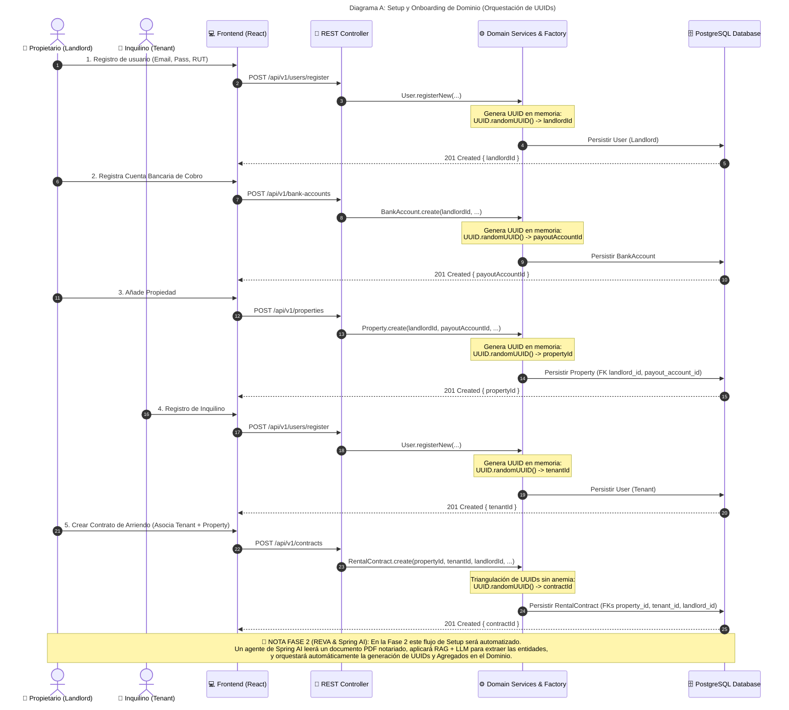

# 🏢 Arquitectura de Dominio, Fundaciones Relacionales y Ciclo de Vida de Identificadores

**Proyecto:** `RentFlow-Core` (Backend B2B PropTech)  
**Estilo Arquitectónico:** Arquitectura Hexagonal (Ports & Adapters) + Domain-Driven Design (DDD)  
**Persistencia:** PostgreSQL  
**Documento Maestro:** `docs/business-flows-and-relational-schema.md`

---

## 🏛️ 1. Fundaciones Relacionales (Base de Datos PostgreSQL)

El diseño relacional de `RentFlow-Core` ha sido concebido para garantizar integridad transaccional estricta en PostgreSQL, alineándose con las fronteras tácticas de los **Agregados de Dominio (DDD)** y aislando el comportamiento de negocio contra anomalías de persistencia o inconsistencias financieras.

```
 +------------------+            +---------------------+            +---------------------+
 |      users       | 1        N |     properties      | N        1 |    bank_accounts    |
 |    (Landlord)    |<-----------|  payout_account_id  |----------->|     (Landlord)      |
 +------------------+            +---------------------+            +---------------------+
          |                                 |                                  |
          | 1                               | 1                                |
          |                                 |                                  |
          | N                               | N                                |
 +------------------+            +---------------------+                       |
 |  subscriptions   |            |      contracts      |                       |
 | (Audit Trail 1:N)|            | (Triangulación UUID)|                       |
 +------------------+            +---------------------+                       |
                                            | 1                                |
                                            |                                  |
                                            | N                                |
                                 +---------------------+                       |
                                 |      payments       |<----------------------+
                                 | (Polimórfico Dual)  |
                                 +---------------------+
```

---

### 1.1 Propietario a Propiedad (1:N)
* **Modelado Relacional:** La tabla `properties` posee una llave foránea rígida `landlord_id REFERENCES users(id)`.
* **Regla de Integridad de Disco:** Un propietario (Landlord) puede poseer $N$ propiedades en el sistema. Sin embargo, a nivel de restricciones de PostgreSQL (`FOREIGN KEY ... ON DELETE RESTRICT`), se prohíbe explícitamente la eliminación física de un registro de usuario si este mantiene propiedades asociadas.
* **Justificación DDD:** La propiedad es una entidad dependiente de la identidad del Propietario. Previene la pérdida inadvertida de activos inmobiliarios y la orfandad de datos en auditorías contables.

---

### 1.2 Propietario a Cuenta Bancaria (1:N Lógico, pero N:1 desde la Propiedad)
* **Landlord a Cuenta Bancaria (1:N):** En la tabla `bank_accounts`, la columna `user_id` vincula múltiples cuentas bancarias (Corriente, Vista, Ahorros) a un mismo Landlord. Un propietario puede registrar $N$ cuentas bancarias en su perfil.
* **Propiedad a Cuenta Bancaria (N:1):** En la tabla `properties`, la llave foránea `payout_account_id REFERENCES bank_accounts(id)` establece que cada propiedad apunta a **una única** cuenta bancaria de cobro.
* **Canalización Financiera Flexible:** Múltiples propiedades pertenecientes al mismo propietario pueden dirigir la recaudación del arriendo mensual hacia la misma cuenta bancaria objetivo, o diversificarse según la estrategia financiera del Landlord.

---

### 1.3 Propietario a Suscripción (1:N en BD para Histórico vs. 1:1 Comercial en Dominio)
* **Regla Comercial (Dominio Java):** Un Landlord solo puede tener **un único plan activo** (`STARTER` para carga manual o `PRO` con inyección de Inteligencia Artificial) en un instante determinado.
* **Modelo en BD (PostgreSQL 1:N):** En la tabla `subscriptions`, la relación con `landlord_id` es $1:N$.
* **Auditoría e Histórico:** Guardar múltiples registros en base de datos permite mantener un rastro inmutable de auditoría comercial. Si un usuario contrata `STARTER` en enero, cancela en junio y suscribe `PRO` en julio, la tabla preservará el registro histórico deshabilitado (`status = CANCELLED`) y el nuevo registro activo (`status = ACTIVE`).

---

### 1.4 Contrato a Entidades (Triangulación UUID & Modelo No Anémico)
* **Triangulación de UUIDs:** La tabla `contracts` (y la entidad de dominio `RentalContract`) actúa como el núcleo transaccional unificador. Únicamente almacena los identificadores escalares UUID: `property_id`, `tenant_id` y `landlord_id`.
* **Diseño No Anémico (Rich Domain Model):**
  * La entidad de dominio `RentalContract` **no contiene referencias JPA anidadas** a objetos completos (`Property`, `Tenant`, `Landlord`).
  * Toda la lógica de negocio (cálculo de fechas de vencimiento `calculatePaymentDueDate`, reajustes por IPC/UF, cálculo de multas por mora `calculateTotalWithPenalty`) se ejecuta directamente sobre el Agregado Raíz.
  * **Beneficios de Rendimiento:** Evita el antipatrón *Anemic Domain Model*, elimina el problema de consultas $N+1$, previene la carga ansiosa (*Eager Loading*) innecesaria de grafos de objetos y reduce el consumo de memoria en JVM.

---

### 1.5 Pagos Polimórficos Agnósticos (Asociación Dual `reference_id` + `payment_target`)
* **Diseño de BD Tradicional (Antipatrón Nulo):** En sistemas tradicionales, la tabla de pagos añadiría columnas `contract_id` y `subscription_id`, provocando que el 50% de las columnas foráneas contengan valores `NULL`.
* **Asociación Polimórfica Agnóstica en RentFlow:** La tabla `payments` elimina columnas restrictivas y utiliza la tupla:
  1. `reference_id` (`UUID`): Identificador único de la entidad comercial que origina el cobro.
  2. `payment_target` (`VARCHAR` / `Enum`): Discriminador funcional (`RENT` o `SAAS`).
* **Escalabilidad Infinito-Flex:** Si la aplicación incorpora nuevos productos cobra-bles (ej. `INSURANCE` para Seguros de Hogar o `MAINTENANCE` para reparaciones), el motor financiero gestiona las transacciones sin modificar el esquema DDL de PostgreSQL ni alterar los índices de la tabla `payments`.

---

## 🆔 2. Ciclo de Vida de Identificadores (UUIDs) y Trazabilidad

En `RentFlow-Core`, el manejo de la identidad cumple strictly con el principio DDD donde la capa de dominio es soberana sobre la creación de sus propios identificadores únicos universales (UUID v4).

```
   [ Java Domain ]                  [ Frontend React ]                   [ REST API Layer ]
   UUID.randomUUID() -------------> Mantiene UUID en Context ----------> Requiere referenceId
  (Static Factory Method)          (Navegación / Checkout)              (Validation & DTOs)
                                                                                  |
                                                                                  v
  [ Database (PostgreSQL) ] <---------------------------------------- [ Application Use Case ]
  findByIdempotencyKey()                                              Genera idempotencyKey
```

---

### 2.1 Generación en el Dominio (Java `UUID.randomUUID()`)
* **Static Factory Methods:** Las entidades de dominio en `core/domain` ocultan sus constructores primarios (`private`) y exponen métodos estáticos normativos (`User.registerNew`, `RentalContract.create`, `Property.create`, `PaymentRecord.createPending`, `BankAccount.create`, `Subscription.create`).
* **Inyección en Memoria:** Los UUIDs principales son instanciados en memoria Java usando `UUID.randomUUID()` al momento de invocar el Factory Method de creación, previo a interactuar con la capa de persistencia.
* **Diferenciación con Reconstitución:** Se separan quirúrgicamente los métodos de creación inicial (`create` / `registerNew`) de los métodos de reconstitución de persistencia (`reconstitute`), estos últimos utilizados por los mappers JPA para reconstruir el estado de la BD preservando el UUID histórico.

---

### 2.2 Ciclo en Frontend React
* **Consumo REST:** El Frontend (React) consulta las entidades a través de la API REST (`GET /api/v1/contracts`).
* **Retención de Estado:** React almacena los UUIDs devueltos en su estado cliente o contexto de la aplicación sin alterar su formato de cadena Canónica de 36 caracteres.
* **Envío Transaccional:** Cuando el inquilino o propietario ejecuta una acción (ej. Checkout), React reenvía el UUID como la propiedad `referenceId` en la carga útil HTTP POST.

---

### 2.3 Inyección de Intención de Negocio y Validación Hexagonal
* **Intención Comercial:** El cliente de React adjunta la constante de negocio en el payload (`paymentTarget: "RENT"` o `"SAAS"`).
* **Adaptador de Entrada (Controller):** La petición es capturada por `PaymentController` haciendo uso de la anotación `@Valid` de Jakarta Validation.
* **Restricción Declarativa:** En `PaymentCheckoutRequestDTO`, se valida la regla de entrada mediante expresiones regulares y validaciones de presencia:
  ```java
  public record PaymentCheckoutRequestDTO (
      @NotNull(message = "Tenant or Landlord ID is required")
      UUID userId,

      @NotNull(message = "Reference ID is required")
      UUID referenceId,

      @NotBlank(message = "Payment target is required")
      @Pattern(regexp = "^(RENT|SAAS)$", message = "Target must be RENT or SAAS")
      String paymentTarget,

      @NotNull(message = "Payment date is required")
      LocalDate paymentDate
  ) {}
  ```
* **Mapeo Tipado:** Una vez aprobada la validación de entrada, la capa de aplicación convierte la cadena sanitizada al Enum de Dominio `PaymentTarget` (`RENT` o `SAAS`), garantizando seguridad de tipos end-to-end.

---

### 2.4 Generación Determinista de `idempotencyKey`
* **Definición de la Clave:** En `InitiatePaymentCheckoutUseCase`, se genera una clave de idempotencia determinista basada en el contexto transaccional:
  $$\text{idempotencyKey} = \text{"PAY-"} + \text{referenceId} + \text{"-"} + \text{YYYY} + \text{"-"} + \text{MM}$$
* **Protección contra Cobros Duplicados:**
  1. Si un Inquilino hace doble clic en el botón de pago o refresca la pantalla, la clave resultante es idéntica.
  2. El caso de uso consulta `PaymentRepository.findByContractId(referenceId)`.
  3. Si ya existe un cobro en estado `PENDING` para la misma fecha de vencimiento (`dueDate`), el sistema reutiliza la orden de pago existente en lugar de duplicar transacciones en la pasarela externa (Stripe/Webpay).

---

## 🔄 3. Flujo del Proceso de Negocio Completo (Diagramas Mermaid)

### Diagrama A: Setup y Onboarding de Dominio (Orquestación de UUIDs)

Visualiza la secuencia técnica mediante la cual se registran las entidades base, se conectan sus UUIDs y se construye el Agregado del Contrato de Arriendo.



---

### Diagrama B: El Motor de Pagos Two-Step Asynchronous (Zero Trust & Webhook)

Visualiza el flujo transaccional completo desde que el inquilino inicia la transacción, la creación del registro `PENDING`, la redirección externa y la conciliación asíncrona por Webhook.

```mermaid
sequenceDiagram
    autonumber
    actor Tenant as 👤 Inquilino (Tenant)
    participant React as 💻 Frontend (React)
    participant PaymentCtrl as 🔌 PaymentController
    participant CheckoutUC as ⚙️ InitiatePaymentCheckoutUseCase
    participant ProcessUC as ⚙️ ProcessPaymentUseCase
    participant DB as 🗄️ PostgreSQL Database
    participant Gateway as 💳 Payment Gateway (Stripe/Webpay)

    title Diagrama B: Motor de Pagos Two-Step Asynchronous (Zero Trust & Webhook)

    %% Step 1: Checkout Initiation
    Tenant->>React: 1. Inicia Checkout de Pago
    React->>PaymentCtrl: POST /api/v1/payments/checkout (userId, referenceId, paymentTarget: "RENT", paymentDate)
    Note over PaymentCtrl: Validación Hexagonal con Jakarta:<br/>@Valid, @NotBlank, @Pattern("RENT|SAAS")
    PaymentCtrl->>CheckoutUC: execute(userId, referenceId, "RENT", paymentDate)

    %% Step 2: Domain calculation & Idempotency Key
    CheckoutUC->>DB: Buscar RentalContract por referenceId
    DB-->>CheckoutUC: RentalContract (propertyId, tenantId, monthlyRent)
    Note over CheckoutUC: Calcula Vencimiento y Multas.<br/>Genera Key Determinista:<br/>idempotencyKey = "PAY-{contractId}-{YYYY}-{MM}"
    CheckoutUC->>DB: Buscar PaymentRecord previo por idempotencyKey
    
    alt Pago PENDING ya existe
        DB-->>CheckoutUC: Reutiliza PaymentRecord existente
    else No existe pago PENDING
        CheckoutUC->>CheckoutUC: PaymentRecord.createPending(...)
        CheckoutUC->>DB: Persistir PaymentRecord (status: PENDING)
    end

    %% Step 3: Gateway URL Generation
    CheckoutUC->>Gateway: generateCheckoutUrl(idempotencyKey, totalAmount)
    Gateway-->>CheckoutUC: Retorna checkoutUrl (https://checkout.stripe.com/pay/...)
    CheckoutUC-->>PaymentCtrl: checkoutUrl
    PaymentCtrl-->>React: HTTP 200 OK { checkoutUrl, status: "PENDING" }

    %% Step 4: Redirection & Payment Execution
    React->>Gateway: Redirige al Inquilino a checkoutUrl
    Tenant->>Gateway: Completa Pago (Tarjeta / Débito)
    Gateway-->>Tenant: Pantalla de Confirmación / Recibo

    %% Step 5: Asynchronous Webhook Reconciliation
    Note over Gateway, PaymentCtrl: 🔔 Conciliación Asíncrona (Two-Step Webhook)
    Gateway->>PaymentCtrl: POST /api/v1/payments/webhook (idempotencyKey, amountPaid, paymentDate, transactionRef, receiptUrl)
    PaymentCtrl->>ProcessUC: execute(idempotencyKey, amountPaid, paymentDate, transactionRef, receiptUrl)
    ProcessUC->>DB: findByIdempotencyKey(idempotencyKey)
    DB-->>ProcessUC: PaymentRecord

    Note over ProcessUC: 🛡️ Verificación Zero Trust:<br/>if (payment.isPaid()) return; (Garantía de Idempotencia)

    ProcessUC->>ProcessUC: payment.registerPayment(...) -> Transición a status: PAID
    ProcessUC->>DB: Persistir PaymentRecord actualizado (PAID)
    ProcessUC-->>PaymentCtrl: PaymentRecord guardado
    PaymentCtrl-->>Gateway: HTTP 200 OK (Webhook Procesado Exitosamente)
```

---

## 📌 Resumen de Garantías Arquitectónicas

| Desafío Táctico | Solución Aplicada | Componente / Mecanismo |
| :--- | :--- | :--- |
| **Eliminación Accidental** | Restricción FK ON DELETE RESTRICT | PostgreSQL DB Schema |
| **Modelos Anémicos** | Rich Domain Model (Triangulación de UUIDs) | `RentalContract.java` |
| **Columnas Nulas en BD** | Asociación Polimórfica Dual (`reference_id` + `payment_target`) | `PaymentRecord.java` / `payments` table |
| **Doble Cobro / Race Condition** | `idempotencyKey` determinista + Verificación Zero Trust | `InitiatePaymentCheckoutUseCase` & `ProcessPaymentUseCase` |
| **Validación de Entradas** | Jakarta Constraints (`@Pattern`, `@NotBlank`, `@Valid`) | `PaymentCheckoutRequestDTO.java` |
