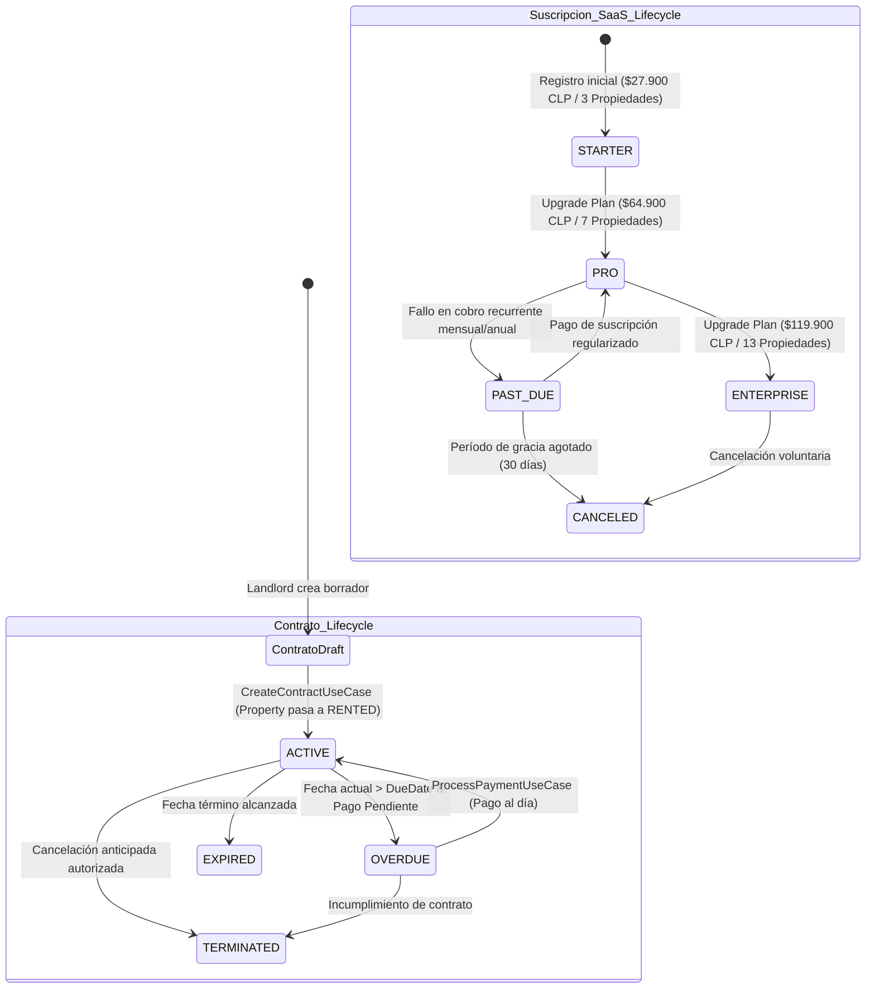

# 📋 Business Requirements Document (BRD) — RentFlowAI

**Documento Maestro de Reglas de Negocio, Guardrails e Invariantes del Sistema (SaaS B2B Chile)**

---

## 1. Control de Versiones y Metadatos

| Parámetro | Detalle |
| :--- | :--- |
| **Proyecto** | RentFlowAI (RentFlow Core Engine) |
| **Documento** | BRD-RentFlowAI.md |
| **Versión** | 1.1.0-ENTERPRISE |
| **Autor** | Lead Technical Writer & Software Architect |
| **Estado** | Aprobado / Inflexible Guardrails |
| **Moneda Base** | Peso Chileno (CLP) / UF / USD |
| **Clasificación** | Confidencial / Core Business Engine |

---

## 2. Filosofía de "Guardrails" Inflexibles

En la arquitectura de **RentFlowAI**, las Reglas de Negocio (BR) se definen como **Guardrails Inflexibles**. No son simples recomendaciones de código; son invariantes de dominio en la capa `core/domain` y validaciones en `core/application` que impiden que el sistema entre en estados financieros o legales inconsistentes.

```text
┌─────────────────────────────────────────────────────────────────────────────┐
│                          CAPA DE GUARDRAILS DE DOMINIO                      │
├─────────────────────────────────────────────────────────────────────────────┤
│  [GUARD-PAY] Escudo de Idempotencia, Divisas y Prevención Doble Cobro       │
│  [GUARD-SUB] Control Estricto de Cuotas, Planes STARTER/PRO/ENTERPRISE      │
│  [GUARD-PROP] Protección Anti-IDOR, Estados Atómicos y Roles               │
└─────────────────────────────────────────────────────────────────────────────┘
```

---

## 3. Subdominio 1: Pagos, Facturación e Idempotencia (`payment`)

### `GUARD-PAY-01`: Clave de Idempotencia Determinista
- **Regla:** Toda orden o intención de pago generada debe poseer una clave única e inmutable con la sintaxis:  
  $$\text{Key} = \text{PAY-}\{contractId\text{\}}-\{YYYY\text{\}}-\{MM\text{\}}$$  
  *(Ejemplo: `PAY-a1b2c3d4-2026-03`)*.
- **Propósito:** Garantizar idempotencia a nivel de almacenamiento y pasarela. Previene que duplicaciones de peticiones HTTP generen cobros múltiples para una misma propiedad y periodo.

### `GUARD-PAY-02`: Filtro Estricto de Prevención de Doble Cobro
- **Regla:** En `InitiatePaymentCheckoutUseCase`, la búsqueda de registros pendientes para reutilización exige obligatoriamente la conjunción lógica **AND (`&&`)**:
  ```java
  p.isPending() && p.getDueDate().equals(dueDate)
  ```
- **Invariante:** 
  - Validar solo `isPending()` captura deudas viejas e imputa pagos al periodo equivocado.
  - Validar solo `dueDate` permite regenerar links de cobro sobre periodos ya saldados (`PAID`).
  - La combinación `&&` es **indispensable** para la corrección financiera.

### `GUARD-PAY-03`: Escudo Inflexible de Divisas (`CurrencyMismatchException`)
- **Regla:** Queda estrictamente prohibido operar o sumar montos en monedas distintas a la pactada en el contrato original.
- **Comportamiento:** Si un contrato está estipulado en `CLP` y se intenta liquidar un payload en `USD`, el sistema interrumpe el flujo arrojando `CurrencyMismatchException` (o `IllegalArgumentException` de negocio).

### `GUARD-PAY-04`: Congelamiento de Cotización y Multas por Mora
- **Regla:** Al solicitar el checkout (`InitiatePaymentCheckoutUseCase`), el sistema calcula la multa por días de atraso acumulados y la congela de forma inmutable en el campo `expectedAmount` del `PaymentRecord`.
- **Propósito:** Garantizar que el monto cobrado en la pasarela externa no fluctúe mientras el inquilino completa la transacción bancaria.

### `GUARD-PAY-05`: Piso Mínimo de Pago (Anti-Underpayment Guard)
- **Regla:** Ninguna transacción puede ser marcada como `PAID` si el monto abonado por el banco es inferior al monto esperado congelado:
  $$\text{amountPaid} < \text{expectedAmount} \implies \text{RECHAZO STRICTO}$$
- **Propósito:** Neutralizar ataques de manipulación de payloads HTTP donde el cliente modifica el monto antes de ser redirigido a la pasarela.

### `GUARD-PAY-06`: Inmutabilidad del Registro Liquidado (`PAID` Lock)
- **Regla:** Un `PaymentRecord` en estado `PAID` queda bloqueado contra modificaciones. No admite cancelación (`cancel()`), re-procesamiento ni sobrescritura de montos.
- **Comportamiento:** Si un Webhook duplicado arriba para un pago saldado, `ProcessPaymentUseCase` retorna el registro intacto de forma idempotente sin alterar la BD.

### `GUARD-PAY-07`: Validación HMAC y Firma Digital de Webhooks
- **Regla:** La entrada del Webhook bancario en la capa de infraestructura debe verificar la firma digital (Secret Hash / HMAC) enviada por Stripe o Webpay antes de transferir el control a la Capa de Aplicación.

---

## 4. Subdominio 2: Suscripciones, Cuotas y Precios B2B (`subscription`)

### Modelo Oficial de Precios B2B Chileno (CLP)

RentFlowAI está adaptado al mercado de inversionistas inmobiliarios pequeños y medianos en Chile, con un costo promedio de ~$9.200 - $9.500 CLP por propiedad/mes:

| Plan | Canon Mensual | Canon Anual (2 meses gratis) | Límite Propiedades | Almacenamiento PDF | Funcionalidades Incluidas |
| :--- | :--- | :--- | :--- | :--- | :--- |
| **STARTER** | **$27.900 CLP / mes** | $279.000 CLP / año | Hasta 3 propiedades | 100 MB | Recaudación básica, reajuste IPC automatizado, recordatorios automáticos por WhatsApp. |
| **PRO** | **$64.900 CLP / mes** | $649.000 CLP / año | Hasta 7 propiedades | 1.000 MB (1 GB) | Todo Starter + Lectura OCR de comprobantes con IA, Webhooks automáticos. |
| **ENTERPRISE** | **$119.900 CLP / mes** | $1.199.000 CLP / año | Hasta 13 propiedades | 10.000 MB (10 GB) | Todo Pro + Auditoría de contratos PDF con Spring AI, Multi-cuenta bancaria de liquidación, soporte prioritario. |

### `GUARD-SUB-01`: Validación de Invariante de Dominio en Cuota de Propiedades
- **Regla:** La API REST y los Casos de Uso rechazarán la creación de una propiedad adicional si el número de propiedades activas del usuario alcanza o supera el `propertyLimit` asignado a su `PlanType` activo:
  $$\text{currentPropertyCount} \ge \text{subscription.getPlanType().getPropertyLimit()} \implies \text{Lanzar IllegalStateException (HTTP 403 Forbidden)}$$
- **Límites Inflexibles en Código Java (`PlanType.java`):**
  - `STARTER`: 3 propiedades.
  - `PRO`: 7 propiedades.
  - `ENTERPRISE`: 13 propiedades.

### `GUARD-SUB-02`: Descuento Anual (2 Meses Gratis)
- **Regla:** Las suscripciones con ciclo de facturación anual (`BillingCycle.YEARLY`) aplican un cobro equivalente a 10 meses pagados por adelantado, otorgando 12 meses de servicio activo (2 meses gratis).

### `GUARD-SUB-03`: Ciclo de Vida y Transición a Período de Gracia (`PAST_DUE`)
- **Regla:** Si el cobro recurrente mensual o anual de la suscripción falla, la suscripción conmuta a `PAST_DUE`. Durante este estado el usuario mantiene acceso de lectura pero no puede registrar nuevas propiedades ni generar cobros automáticos.

---

## 5. Subdominio 3: Inmuebles, Contratos y Ciclo de Vida (`property` / `contract`)

### `GUARD-PROP-01`: Protección Multitenant Anti-IDOR (Landlord Ownership)
- **Regla:** Un `Landlord` solo puede crear o modificar contratos sobre propiedades de las cuales es el dueño legal verificado:
  $$\text{property.getLandlordId()} = \text{authenticatedLandlordId}$$

### `GUARD-PROP-02`: Conmutación Atómica de Estado de Propiedad
- **Regla:** La creación e inicio exitoso de un `RentalContract` cambia atómicamente el estado de la `Property` de `AVAILABLE` a `RENTED` en la misma transacción de base de datos.

### `GUARD-PROP-03`: Validación Estricta de Rol de Inquilino (`TENANT`)
- **Regla:** El usuario asignado como arrendatario en un `RentalContract` debe poseer obligatoriamente el rol `Role.TENANT` en el agregado `User`.

### `GUARD-PROP-04`: Ventana Mínima de Reajuste por IPC
- **Regla:** El reajuste de canon de arriendo por IPC solo puede aplicarse si han transcurrido al menos 6 meses desde la fecha de inicio o el último reajuste del contrato.

---

## 6. Diagramación Visual de Arquitectura (Mermaid.js)

### 6.1 Diagrama de Flujo: Ciclo de Vida Completo del Pago (Checkout & Webhook)

```mermaid
flowchart TD
    %% Estilos y Clases
    classDef actor fill:#1e293b,stroke:#475569,stroke-width:2px,color:#fff
    classDef process fill:#0f172a,stroke:#3b82f6,stroke-width:2px,color:#fff
    classDef decision fill:#312e81,stroke:#6366f1,stroke-width:2px,color:#fff
    classDef guard fill:#7f1d1d,stroke:#ef4444,stroke-width:2px,color:#fff
    classDef success fill:#064e3b,stroke:#10b981,stroke-width:2px,color:#fff

    A[Tenant: Petición Checkout POST /payments/checkout] ::: actor --> B[InitiatePaymentCheckoutUseCase] ::: process
    
    B --> C{Guard Anti-IDOR: contract.tenantId == authenticatedTenantId?} ::: decision
    C -- No --> D[Lanzar IllegalStateException / 403 Forbidden] ::: guard
    
    C -- Sí --> E{Buscar pago pendiente: p.isPending && p.dueDate == currentDueDate} ::: decision
    E -- Existe Pendiente --> F[Reutilizar PaymentRecord existente] ::: process
    E -- No Existe --> G[Generar Clave Idempotencia PAY-Contract-YYYY-MM & Crear PaymentRecord PENDING] ::: process
    
    F --> H[Invocar PaymentGatewayPort: Generar Checkout URL] ::: process
    G --> H
    
    H --> I[Retornar Checkout URL al Tenant / Redirección Banco] ::: actor
    
    I --> J[Tenant paga en Pasarela Externa Stripe / Webpay] ::: actor
    
    J --> K[Pasarela envía Webhook POST /payments/webhook] ::: actor
    K --> L{Validar Firma HMAC en Controller} ::: decision
    L -- Firma Inválida --> M[Rechazar Webhook 401 Unauthorized] ::: guard
    
    L -- Firma Válida --> N[ProcessPaymentUseCase] ::: process
    N --> O{Verificar idempotencyKey} ::: decision
    
    O -- Ya está PAID --> P[Retornar 200 OK Idempotente sin alterar BD] ::: success
    
    O -- Está PENDING --> Q{Guard Anti-Underpayment: amountPaid >= expectedAmount?} ::: decision
    Q -- No --> R[Lanzar IllegalArgumentException / Abortar Liquidación] ::: guard
    
    Q -- Sí --> S[PaymentRecord.registerPayment: Transición a PAID] ::: process
    S --> T[Persistir en PaymentRepository & Enviar Comprobante Email] ::: success
```

---

### 6.2 Diagrama de Estados: Ciclos de Vida de Contrato y Suscripción


